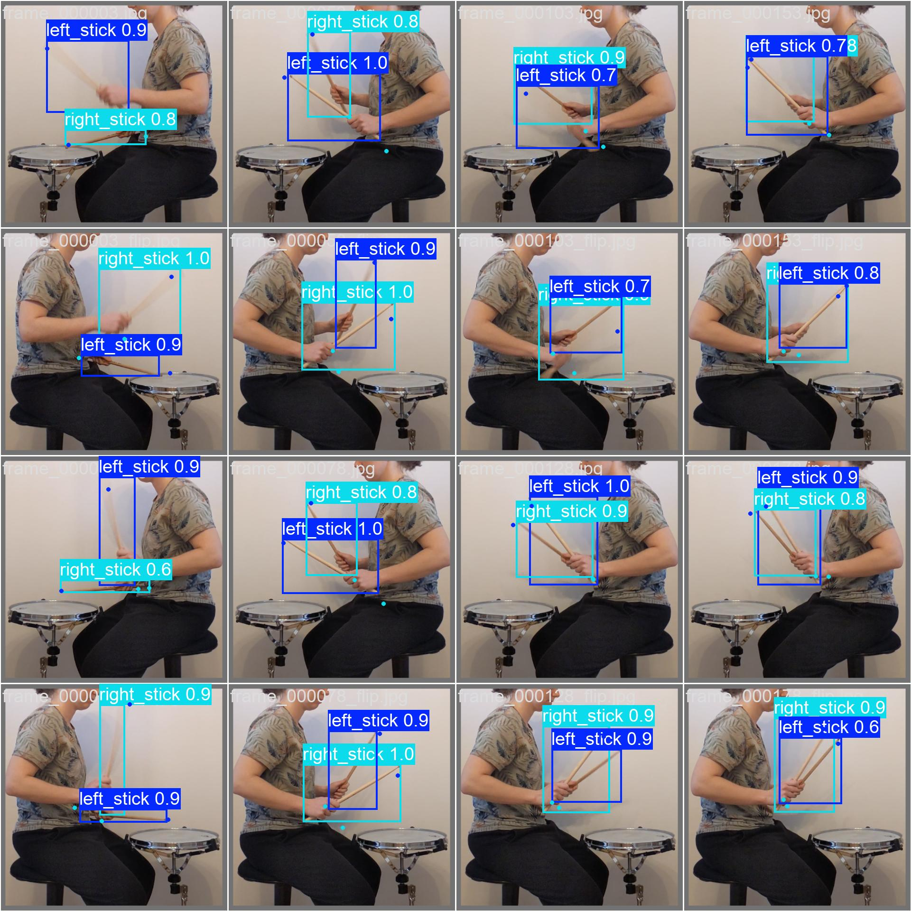

# Applied deep learning project
Alina Jaud - 12209471

## Table of Contents
1. [Idea and Project Type](#idea-and-project-type)
2. [Background Research](#background-research)
3. [Planned Approach](#planned-approach)
4. [Schedule](#schedule)
5. [Usage Documentation](#usage-documentation)
6. [Performance and Results](#performance-and-results-for-assignment-2)
7. [Outlook](#outlook)
8. [References](#references)
## Idea and Project Type
I want to create an application that can measure the performance of drummers practicing on a drum pad. The application should track sticks on a video where a drummer is playing on a drum pad. The tracked sticks can be used to record the playing and calculate some metrics, for example the stick height on left and right hand, the straightness of the hits or the angle of the hits. These metrics can help the player to improve their drumming.
For this project I chose the project category “bring your on data”.
## Background Research
There are several approaches in tracking drumsticks with deep learning technologies. The majority of the methods are built to enable air drumming, which means moving sticks in the air without an actual drumset. Hong et al. [1] propose a framework that can detect drumsticks with markes on the tip using YOLOv8. Yadid et al. [2] provide a markerless approach with the YOLOv5 model. Both approaches give valuable insights in their dataset creation and network training but have not published their datasets. Since they both focus on air drumming, they did not train their networks on frames of people drumming on an actual drum pad.
Additional to stick tracking, hand pose tracking can generate valuable metrics for drum performance analytics. Therefore OpenPose [3] and MediaPipe [4] are considered to be used in the application.
## Planned Approach
A major part of the project will be dataset creation. I plan to use a smartphone camera and a tripod to record videos from different angles. The dataset will then be split into frames and annotated with Roboflow [5] or CVAT [6]. Rotation and brightness change will be applied to reduce the number of necessary samples and introduce robustness. For training, I will use a pre-trained network. In a final application, a platform to upload a video will be provided. Th application can then calculate some easy metrics like stick height.
## Schedule
### Planned Schedule
* Now – 1. 11: Recording videos
* 2.11 – 10. 11: preprocess videos for data annotation
* 11.11 – 1. 12: Create annotations
* 1.12 – 17.12: Use a pre-trained model and test against a minimal dataset (deadline assignment 2)
* 18.12.-6.1. Improve quality of dataset, adjust model
* 7.01-21.01. Build application around model (deadline assignment 3)
### Working Hours Breakdown (until deadline assignment 2)
* Recording videos: 1h
* Preprocessing videos: 3h
* Getting to know data annotation tool (CVAT): 4h
* Annotating data with CVAT: 5h
* Data preprocessing: 6h
* Train and validate pretrained YOLO model: 2h
* Data optimization (augmentation and gathering more data): 5h
* Documentation 2h
## Usage Documentation
### Installation
1. Create conda environment by running `conda env create -f environment.yaml -n <your env name>` inside the projects folder
2. Create the training data folder. It MUST have the following structure:
```
data/
    images/
        train/
        val/
    labels/
        train/
        val/
```
The actual training images belong into the images/train folder, whereas for each image a annotation text file belongs into the labels/train folder. Image and label file must have the same file name.
These files will be used by the YOLO framework during training.
The images/val and respectively lables/val folders contain the data that is only used for validation, following the same naming conditions as the files in the train folders.

### Image Labeling
Images are labeled using [CVAT](https://www.cvat.ai/). There are two classes ``left_stick`` and ``right_stick``. For now each stick in the image is labeled with a bounding box and two keypoints (for stick tip and bottom). 
Each image has a labeling file, its naming conventions are `[image_name].txt`.
Below is an example content of this labeling file:
```
0 0.371875 0.4765625 0.4375 0.1125 0.14845312500000002 0.422171875 0.592484375 0.53409375 
1 0.45234375 0.615625 0.3453125 0.103125 0.278625 0.6679062499999999 0.627765625 0.5669375 
```
Each row represents one detection, the first digit is the class label (0 -left stick, 1 - right stick).
The following next 4 values represent the bounding box and the last two values are the keypoints for stick tip and stick bottom.
The next section describes how to automatically create such a labeling file.
### Data preparation
In order to train the model you need to fill it with data. 
It is your responsibility to create the data and annotate it, as the training data set is not provided currently. However, if you annotated your data with CVAT, there is a script that creates the correct label files out of the CVAT annotation xml file. 
In CVAT, export your annotation in the format "CVAT for video 1.1".
Simply excute ``data_preparation/data_preparation_script.py``. Change the path to the correct locations of your annotation file and specify an output folder befor running the script.
You can adapt the script to produce flipped images (see code documentation).
Then simply copy the images and label files to the correct location inside the data folder.


#### Data augmentation
YOLO framework provides built in data augmentation, however, for this use case, images, class labels and keypoints are flipped manually. 
To flip images, you execute the flip image method the the data preparation script like this:
```
flip_images(INPUT_FOLDER, OUTPUT_FOLDER)
```
In the next step you can create flipped label files by executing this method in the script:
```
create_labels(OUTPUT_FOLDER_LABELS, ANNOTATIONS, flip=True)
```
### Run Training
To run a training, the first step is to adapt the config.yaml file. TODO
## Performance and Results (for assignment 2)
### Data collected so far
I recorded videos of myself playing some common stick technique exercises and took the first 10 seconds of the video. From that I exported every 5th frame and took it into the training data set. 
In total I manually created data annotations for 68 video frames. By applying the flipping annotatins script, I now have 136 labelled images in my training data set. 
### Performance metric
For measuring the performance I chose the mean average precision (mAP), which is calculated based on Intersection over Unit (IoU) metric, that calculated accuracy of bounding boxes.
The mAP metric calculates the mean of the average precision values across all classes and/or IoU  thresholds. It provides a holistic evaluation of a model's detection accuracy.
### Performance measurements
| Run No. | Flipped Images | mAP   | Epochs |
|-----|----------------|-------|--------|
| 6   | No             | TODO  | 5     |
| 4   | No             | TODO | 5     |
| 9   | Yes            |  0.976  | 20     |



(Visual results for run no. 9)


## Outlook
My plan until the next assignment deadline is to create more training data with more variations in the images and play around with hyper parameters and the data augmentations provided by the YOLO framework.
Then the plan is to create a simple web page where one can upload a video of itself drumming, and the webside provides a video with tracked stick tips and optionally provides an average stick height metric for left and right hand, as a usecase on how this AI can help drummers in analyzing their drumming performance.

## References
[1]	S. Hong, K. Stephen, and T. Kenji, “Virtual Drum System Development using Motion Detection,” IIAI Letters on Informatics and Interdisciplinary Research, vol. 5, p. 1, 2024, doi: 10.52731/liir.v005.263.

[2]	H. Yadid, A. Algranti, M. Levin, and A. Taitler, “A2D: Anywhere Anytime Drumming,” 2023.

[3]	Z. Cao, G. Hidalgo, T. Simon, S.-E. Wei, and Y. Sheikh, “OpenPose: Realtime Multi-Person 2D Pose Estimation using Part Affinity Fields,” 2018.

[4]	Mediapipe: A framework for perceiving and processing reality, 2019.

[5]	F. Ciaglia, F. S. Zuppichini, P. Guerrie, M. McQuade, and J. Solawetz, “Roboflow 100: A Rich, Multi-Domain Object Detection Benchmark,” 2022.

[6]	CVAT, CVAT Documentation. [Online]. Available: https://docs.cvat.ai/docs/

